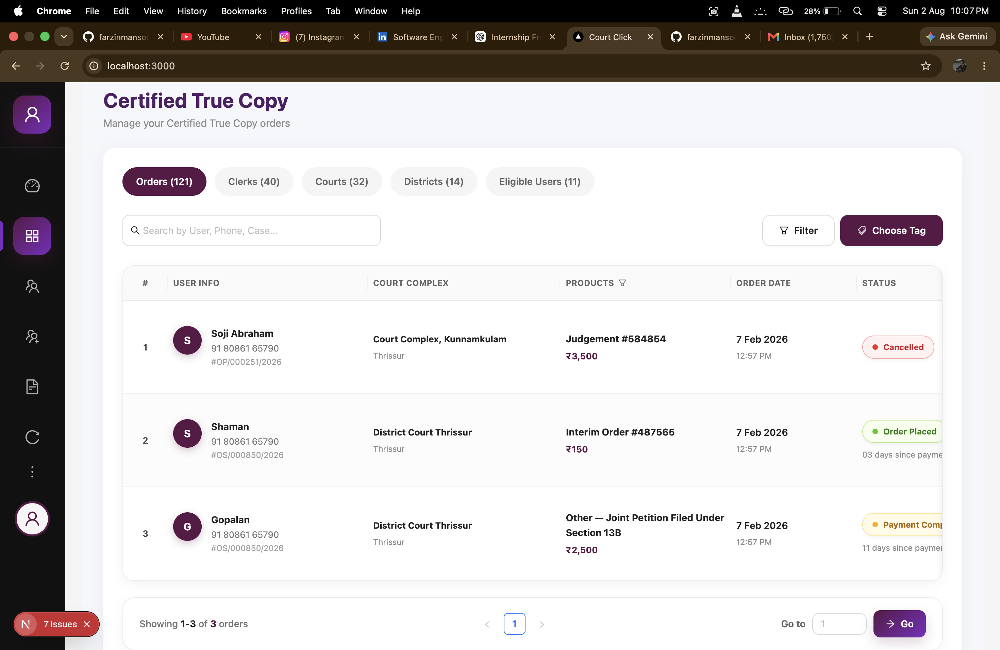
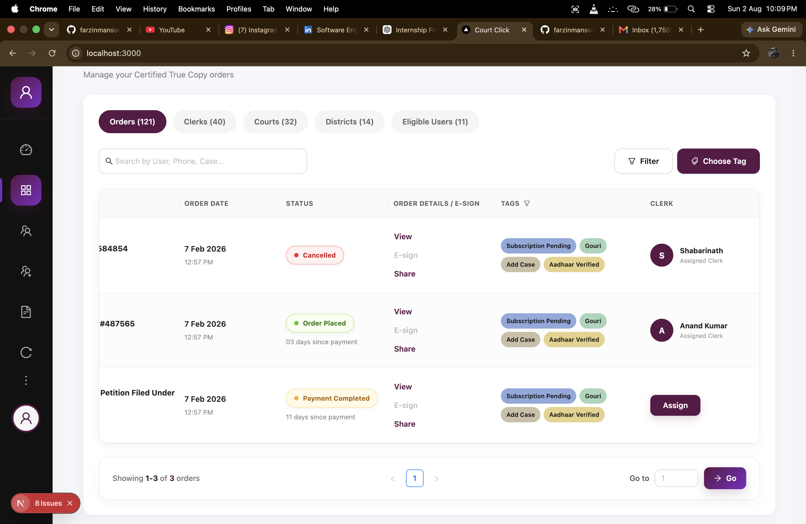
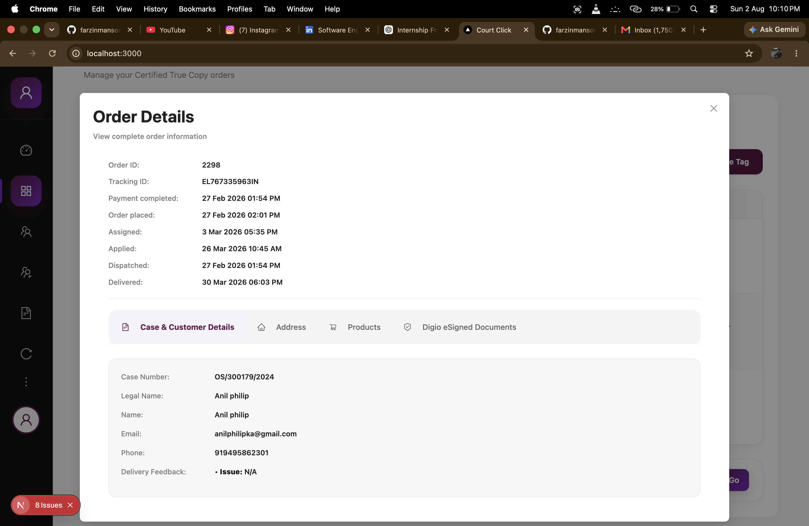
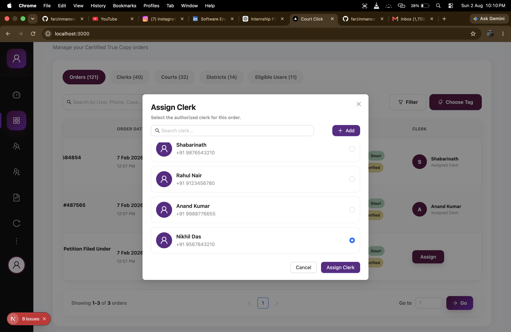
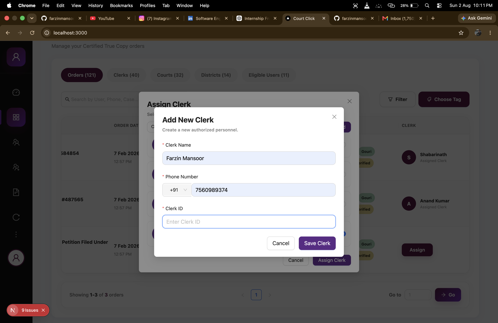
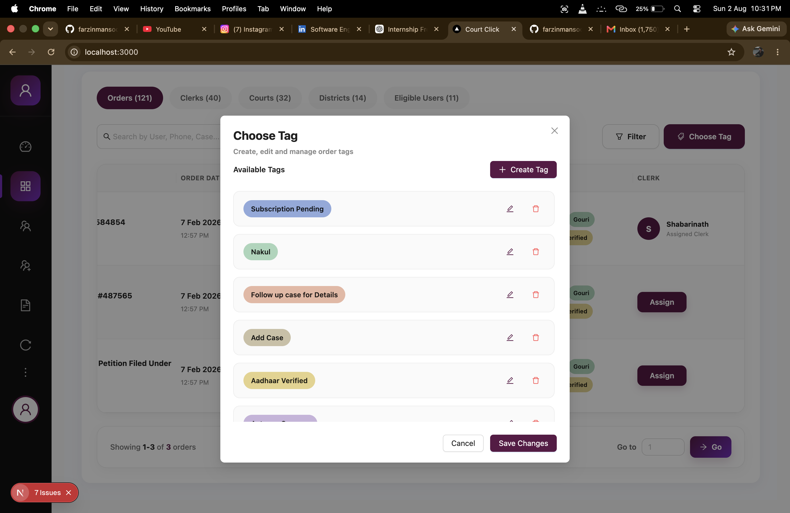
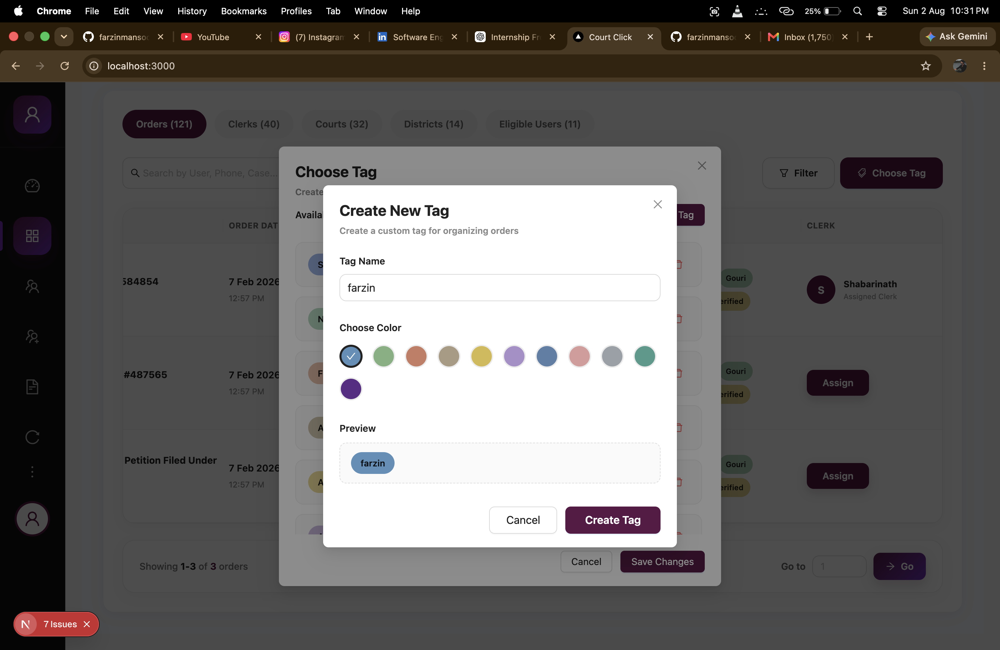
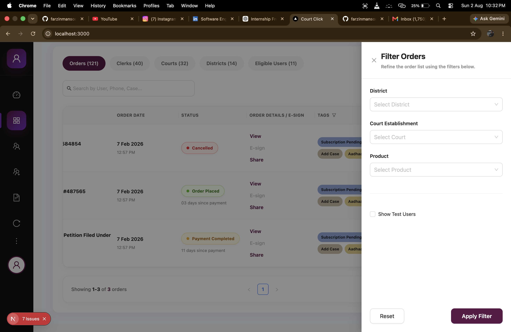
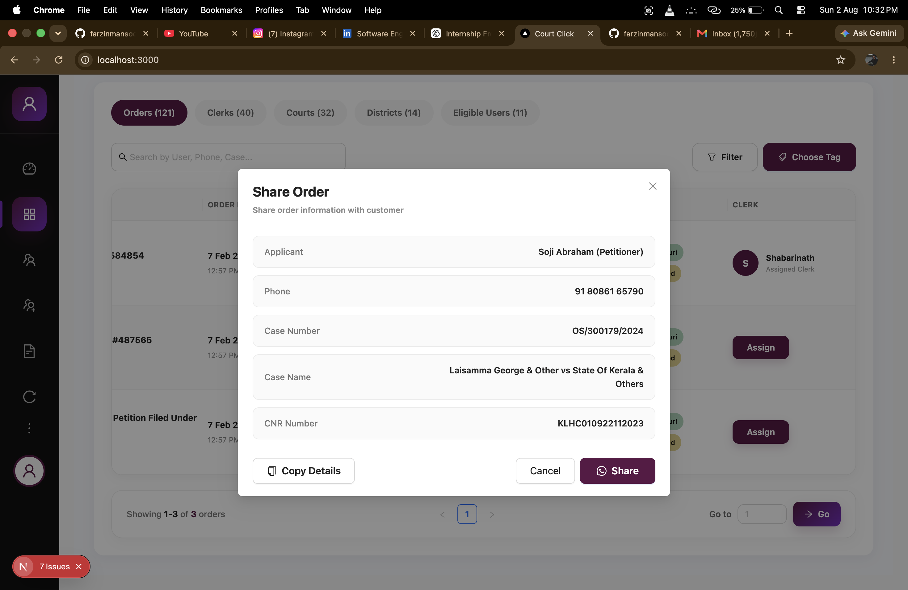
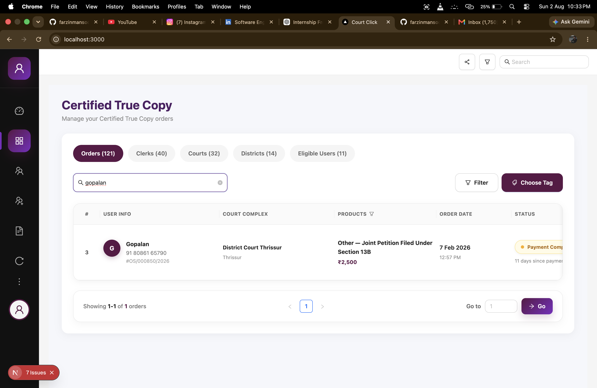

# CourtClick Frontend Machine Test

A modern and responsive frontend application developed as part of the **CourtClick Frontend Machine Test**.

The application is built using **Next.js**, **TypeScript**, and **Ant Design**, following the provided Figma design while maintaining clean, reusable, and scalable code.

---

# 🚀 Live Demo

**Vercel Deployment**

https://courtclick-frontend-machine-test.vercel.app

---

# 📂 GitHub Repository

https://github.com/farzinmansoor/courtclick-frontend-machine-test

---

# 📸 Screenshots

## Dashboard



---

## Orders Table



---

## Order Details


---

## View Order Modal



---

## Assign Clerk Modal



---

## Add Clerk Modal



---

## Edit Tag Modal



---

## Create Tag Modal



---

## Filter Drawer



---

## Share Modal



---

## Search Feature



---

# ✨ Features

- Pixel Perfect UI based on Figma
- Responsive Layout
- Built with Next.js App Router
- TypeScript Support
- Ant Design Components
- Search Orders
- Orders Management Table
- Status Badges
- Clerk Assignment
- Order Details Modal
- Tag Management
- Create Tag
- Edit Tag
- Delete Tag
- Share Modal
- Filter Drawer
- Reusable Components
- Clean Folder Structure

---

# 🛠 Tech Stack

- Next.js
- React
- TypeScript
- Ant Design
- CSS
- Vercel

---

# 📁 Folder Structure

```text
.
├── images
├── public
├── src
│   ├── app
│   ├── components
│   ├── data
│   ├── types
│   └── styles
├── package.json
└── README.md
```

---

# ⚙️ Installation

Clone the repository

```bash
git clone https://github.com/farzinmansoor/courtclick-frontend-machine-test.git
```

Move into the project

```bash
cd courtclick-frontend-machine-test
```

Install dependencies

```bash
npm install
```

Run the development server

```bash
npm run dev
```

Open your browser

```
http://localhost:3000
```

---

# 📦 Production Build

Create a production build

```bash
npm run build
```

Run production server

```bash
npm start
```

---

# 📋 Implemented Modules

- Dashboard
- Orders Table
- Search Functionality
- Filter Drawer
- Clerk Assignment
- Order Details Modal
- Tag Management
- Create Tag Modal
- Edit Tag Modal
- Share Modal
- Responsive Layout

---

# 📸 Project Images

All screenshots used in this README are stored inside the **images/** folder.

```
images/
├── dashboard.png
├── orders-table.png
├── order-details.png
├── view-order-modal.png
├── assign-clerk-modal.png
├── Add-clerk.png
├── edit-tag-modal.png
├── create-tag-modal.png
├── filter-drawer.png
├── share-modal.png
└── search-feature.png
```

---

# 🎯 Project Highlights

- Pixel Perfect UI
- Responsive Design
- Component-Based Architecture
- Reusable Components
- Clean Code Structure
- TypeScript Support
- Ant Design UI
- Easy to Maintain
- Production Ready

---

# 👨‍💻 Developer

**Farzin Mansoor**

Computer Science and Engineering Student

### GitHub

https://github.com/farzinmansoor

### LinkedIn

https://www.linkedin.com/in/farzin-mansoor-8045b3361/

---

# 📄 License

This project was developed for the **CourtClick Frontend Machine Test** as a frontend implementation based on the provided Figma design.
